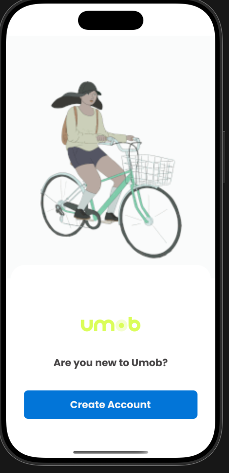
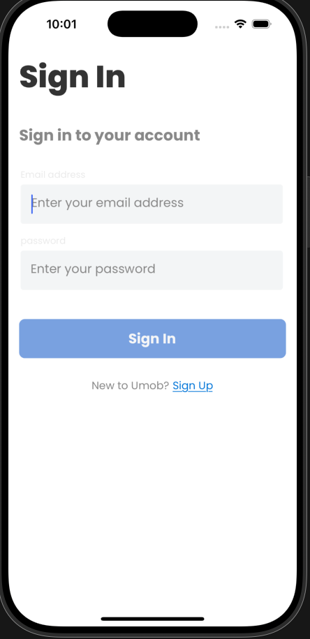
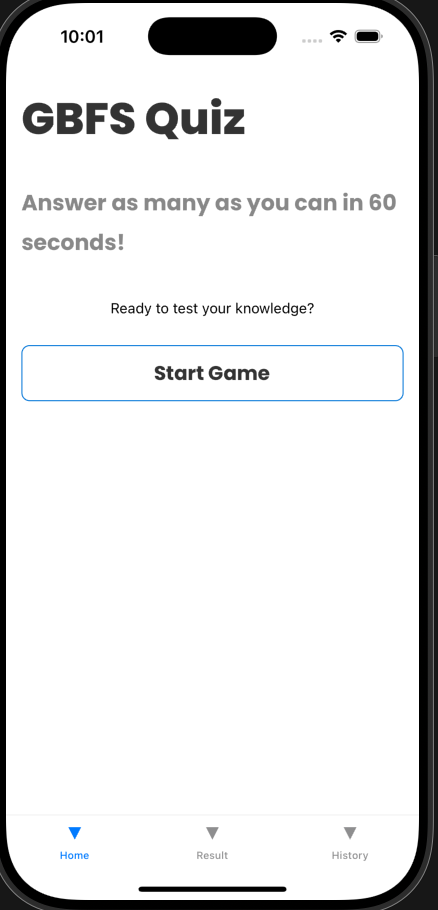
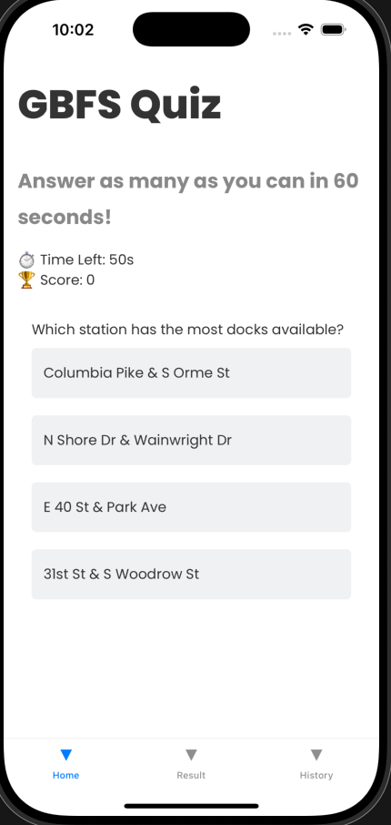
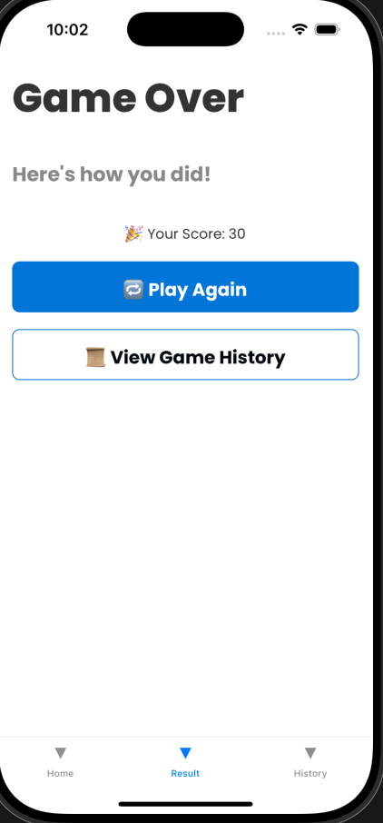
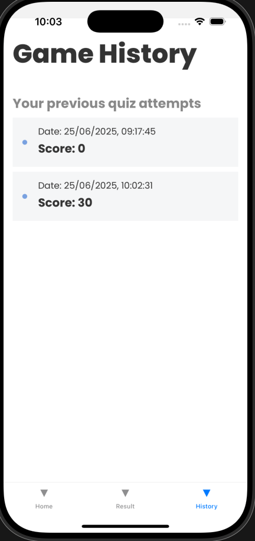

# GBFSpark
A React Native mobile application built to consume and present data from the General Bikeshare Feed Specification (GBFS) using a clean and scalable architecture. Designed and implemented in a modular way, the application demonstrates integration with external APIs, data management, and reusable UI components.









# Project Thinking & Structure
### Architecture Overview (Atomic Design)

The app is built using Atomic Design Methodology, a pattern that encourages scalability, reusability, and consistency in UI development. This design system is divided into 5 stages, but for this app we focus on:
- # Atoms
    - These are the foundational UI components, like text variants (e.g., BodyMedium, H6) and simple wrappers.
    - Example:
    ```import BodyMedium from '@components/atoms/text/bodyMedium';```

- # Molecules
    - These are combinations of atoms working together as a functional unit (e.g., buttons).
    - ```ParentView:``` A basic screen wrapper for static content.
    - ```ParentScrollView:``` For scrollable content with keyboard handling and padding logic.
    - Example:
    ```<ParentView noPadding>{/* Child Components */} </ParentView>```

- # Templates
    - These define the layout structure and include logic for scroll/gesture handling and spacing based on safe area insets, handling safe-areas, status-bar, padding, keyboards, etc.
    - Example:
    ```<GBFSButton text="Create Account" onPress={onPressPrimaryButton} />```

# Why Atomic?
   - Predictable file tree – new joiners locate components instantly.
   - Re-use is encouraged; no duplicated styles.
   - Changes are low-risk – altering an atom cascades consistently.
   - Scales from prototype to production without painful renames.

# Thought Process Summary
The application starts with a well-defined design system using the Atomic methodology, ensuring every visual and functional element is reusable and testable. Each screen is split into containers and presentational components, with business logic separated from UI logic. The welcome screen, for instance, uses atomic components (texts, images) combined into a molecule (GBFSButton), wrapped in a template (ParentView) to ensure consistent layout styling.

APIs will be consumed using a service abstraction pattern, and state management will follow a Redux-style separation as complexity increases.

# Tech Stack & Rationale

| Tech                          | Why it was used                                             |
| ----------------------------- | ----------------------------------------------------------- |
| **React Native**              | For building performant, cross-platform mobile apps         |
| **TypeScript**                | For type safety, better tooling, and maintainability        |
| **Atomic Design**             | For scalable and reusable component architecture            |
| **Safe Area Context**         | To respect device boundaries (like notches and status bars) |
| **Keyboard Aware ScrollView** | For better keyboard interaction UX                          |
| **Metro Bundler**             | For hot reloading and fast development feedback             |


# Getting Started

> **Note**: Make sure you have completed the [Set Up Your Environment](https://reactnative.dev/docs/set-up-your-environment) guide before proceeding.

## Step 1: Clone the repository

```git clone https://github.com/Bluebird2000/GBFSpark```

```sh
# cd to project directory and install dependencies using npm
npm install

# once npm is done installing, cd to the ios directory and run
pod install

## Step 2: Build and run your app

With Metro running, open a new terminal window/pane from the root of GBFS project, and use one of the following commands to build and run your Android or iOS app:

### Android

```sh
# Using npm
npm run android

# For IOS
npm run ios
```

### iOS

For iOS, remember to install CocoaPods dependencies (this only needs to be run on first clone or after updating native deps).

If everything is set up correctly, you should see the GBFSpark app running in the Android Emulator, iOS Simulator, or your connected device.

This is one way to run the GBFS app — you can also build it directly from Android Studio or Xcode.

## Step 3: Modify THE app

Now that you have successfully run the app, let's make changes!

Open `App.tsx` in your text editor of choice and make some changes. When you save, your app will automatically update and reflect these changes — this is powered by [Fast Refresh](https://reactnative.dev/docs/fast-refresh).

When you want to forcefully reload, for example to reset the state of your app, you can perform a full reload:

- **Android**: Press the <kbd>R</kbd> key twice or select **"Reload"** from the **Dev Menu**, accessed via <kbd>Ctrl</kbd> + <kbd>M</kbd> (Windows/Linux) or <kbd>Cmd ⌘</kbd> + <kbd>M</kbd> (macOS).
- **iOS**: Press <kbd>R</kbd> in iOS Simulator.

## Congratulations! :tada:

You've successfully run and modified the GBFSpark App. :partying_face:

## Things I'd Improve with More Time
- Add full i18n support for internationalization
- Add full theming support
- Persist state securely using end-to-end encryption.
- Setup snyk to help scan dependencies and code for vulnerabilities, and sonar cloud to help analyze code for bugs, code smells, duplication, and coverage.
- Refactor API service to a more scalable repository pattern.
- Real backend (Firebase or Supabase) for cross-device auth & leaderboard.
